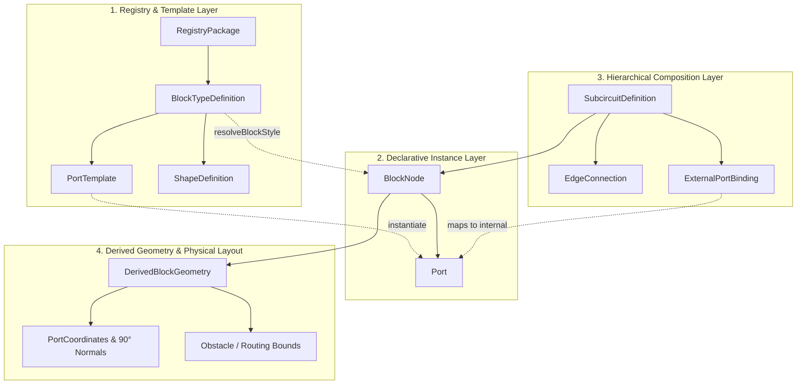

# 📐 Глубокий аудит DSL описания блоков в AutoTrace

## 1. Введение и Архитектурный контекст

В рамках библиотеки `@autotrace/sdk` и ядра `go_engine/core` **DSL (Domain-Specific Language) описания блоков** представляет собой декларативный контракт спецификации топологических узлов, дискретных портов ввода-вывода, пространственных ограничений, визуальных форм и иерархических подсхем.

DSL охватывает три ключевых уровня:
1. **Базовый объектный DSL (`BlockNode`, `Port`, `EdgeConnection`)** — контракт уровня рантайма и алгоритмов трассировки.
2. **Иерархический DSL подсхем (`SubcircuitDefinition`, `ExternalPortBinding`)** — композиция многоуровневых электронных и логических систем.
3. **Реестровый DSL (`BlockTypeDefinition`, `ShapeDefinition`, `PortTemplate`, `RegistryPackage`)** — типобезопасная расширяемая компонентная база с контролем версий и инвалидацией кэша.

---

## 2. Структурно-семантический аудит слоев DSL



### 2.1. Базовый DSL блоков (`BlockNode`)

| Поле | Тип | Назначение | Оценка зрелости |
| :--- | :--- | :--- | :---: |
| `id` | `string` | Уникальный идентификатор узла в графе | ⭐⭐⭐⭐⭐ (Отлично) |
| `title`, `subtitle` | `string` | Основной заголовок и подзаголовок блока | ⭐⭐⭐⭐⭐ (Отлично) |
| `category` | `'source' \| 'processor' \| 'sink' \| 'logic' \| 'storage' \| 'custom'` | Семантическая классификация для ранжирования слоев | ⭐⭐⭐⭐⭐ (Отлично) |
| `semanticType` | `string` | Ссылка на `NamespacedID` в реестре (например, `core/block/sensor`) | ⭐⭐⭐⭐⭐ (Отлично) |
| `x`, `y`, `width`, `height` | `number` | Мировые координаты и габариты | ⭐⭐⭐⭐⭐ (Отлично) |
| `inputs`, `outputs` | `Port[]` | Массивы дискретных точек подключения | ⭐⭐⭐⭐⭐ (Отлично) |
| `autoSize` | `boolean` | Флаг авто-подгонки размера под количество пинов и текст | ⭐⭐⭐⭐⭐ (Отлично) |
| `shape` | `BlockShape` | Геометрическая форма (`rectangle`, `rounded`, `chip_ic`, `circle`, `diamond`, `hexagon`) | ⭐⭐⭐⭐⭐ (Отлично) |
| `routingClearance` | `number` | Индивидуальный зазор безопасности вокруг блока | ⭐⭐⭐⭐⭐ (Отлично) |
| `isPinned` | `boolean` | Защита от смещения при NLP-оптимизации и авто-лейауте | ⭐⭐⭐⭐⭐ (Отлично) |
| `imageUrl`, `imageFit` | `string`, `ImageFitMode` | Кастомизация фоновым растровым/векторным изображением | ⭐⭐⭐⭐ (Хорошо) |

### 2.2. DSL спецификации портов (`Port`)

Портовая модель AutoTrace является одной из самых проработанных в открытых библиотеках диаграмм:

```typescript
export interface Port {
  id: string;
  name: string;
  type: PortType;                  // 'input' | 'output' | 'inout' | 'passive'
  dataType?: PortDataType;         // 'signal' | 'bus' | 'clock' | 'power' | ...
  side?: PortSide;                 // 'left' | 'right' | 'top' | 'bottom'
  placementMode?: PortPlacementMode; // 'fixed' (зафиксирован) | 'adaptive' (авто-распределение)
  relativePosition?: number;       // 0.0 .. 1.0 вдоль грани
  customOffset?: number;           // Точное пиксельное смещение от угла
  pinNumber?: number;              // Номер вывода в корпусе (Pin 1..N)
  preferredSide?: PortSide;        // Предпочтительная грань при адаптивной трассировке
  allowedSides?: PortSide[];       // Разрешённые грани (например, ['top', 'bottom'])
  order?: number;                  // Детерминированный порядок следования
  groupId?: string;                // Группировка связанных шин (например, 'SPI_BUS')
  color?: string;                  // Переопределение цвета контакта
  minSpacing?: number;             // Минимальный шаг между соседними выводами
}
```

#### Ключевые преимущества:
1. **Поддержка 4-стороннего расположения**: Порты могут находиться на любой из граней (`left`, `right`, `top`, `bottom`) со строгим расчетом нормалей $\vec{n} \in \{(\pm 1, 0), (0, \pm 1)\}$.
2. **Детерминированная сортировка**: `sortPortsDeterministically` гарантирует стабильный порядок вычислений: `Group -> Order -> Pin Number -> ID`.
3. **Шинные группы (`groupId`)**: Позволяет удерживать связанные линии (CLK, MOSI, MISO, CS) в едином плотном пакете.

---

### 2.3. Иерархический DSL подсхем (`SubcircuitDefinition`)

Позволяет создавать рекурсивно вложенные многоуровневые системы (SoC $\to$ Core $\to$ ALU):

```typescript
export interface SubcircuitDefinition {
  id: string;
  name: string;
  category?: 'logic' | 'processor' | 'storage' | 'custom' | 'io';
  nodes: BlockNode[];
  edges: EdgeConnection[];
  externalInputs: ExternalPortBinding[];
  externalOutputs: ExternalPortBinding[];
}

export interface ExternalPortBinding {
  id: string;              // Внешний ID порта на родительском блоке
  name: string;            // Отображаемое имя
  type: PortType;          // 'input' | 'output' | 'inout'
  dataType?: PortDataType;
  side: PortSide;          // Грань на внешнем блоке
  internalNodeId: string;  // Целевой блок внутри схемы
  internalPortId: string;  // Целевой порт на внутреннем блоке
}
```

* **Инкапсуляция**: Внутренние узлы изолированы от внешнего графа.
* **Трансляция интерфейса**: `ExternalPortBinding` обеспечивает сквозной биндинг без создания циклических ссылок.

---

### 2.4. Реестровый DSL компонентной базы (`RegistryClient`)

Реестр обеспечивает версионирование (`1.0.0`), жизненный цикл (`draft` $\to$ `published` $\to$ `deprecated`) и классификацию инвалидации:

* `render` — изменился цвет/иконка (перерисовка без перетрассировки).
* `routing_geometry` — изменились габариты или расположение пинов (полный пересчет A*).
* `layout` — изменилась структура связей (пересчет Sugiyama/NLP).

---

## 3. Оценка преимуществ и сильных сторон

1. 🟢 **Математическая строгость**: Все геометрические производные (`DerivedBlockGeometry`) рассчитываются детерминированно с привязкой к сеткам `BASE_GRID` (4px), `PLACEMENT_GRID` (10px), `ROUTING_GRID` (10px).
2. 🟢 **Zero-Dependency Core**: DSL описывается чистыми TypeScript интерфейсами без привязки к React/DOM.
3. 🟢 **Go/WASM Паритет**: Структуры данных в `go_engine/core/types.go` имеют 100% бинарный и JSON-паритет с TypeScript.
4. 🟢 **Авто-сайзинг блоков**: Функция `calculateMinimumBlockSize` автоматически рассчитывает габариты блока с учётом количества портов на каждой из 4 граней, шрифтовых метрик заголовка/подзаголовка и защитных отступов от углов (`cornerMargin = 14px`).

---

## 4. Выявленные ограничения и зоны роста (Gaps & Vulnerabilities)

### ⚠️ Проблема 1: Отсутствие Runtime-валидации схемы (Schema Validation)
* **Текущее состояние**: DSL валидируется только на этапе компиляции TypeScript. При загрузке некорректного JSON из внешнего приложения (например, отрицательный `width`, дублирующиеся `port.id` или неверный `side: 'invalid'`) ошибка возникает глубоко внутри алгоритма A*.
* **Рекомендация**: Добавить легковесный валидатор схемы (Zod или встроенный micro-validator без зависимостей `validateBlockNode(node)`), возвращающий массив диагностических сообщений `DiagnosticIssue[]`.

### ⚠️ Проблема 2: Разделение `inputs` и `outputs` при наличии 4 граней
* **Текущее состояние**: Исторически в `BlockNode` порты разделены на два массива: `inputs: Port[]` и `outputs: Port[]`. Однако в современных EDA-схемах порт на верхней грани (`side: 'top'`) может быть `input` (например, шина питания или тактовый сигнал CLK) или `inout` (двунаправленная шина I2C SDA).
* **Рекомендация**: Ввести канонический единый массив `ports?: Port[]` с геттером `allPorts`, сохраняя обратную совместимость с `inputs`/`outputs`.

### ⚠️ Проблема 3: Отсутствие текстового (Human-Readable) мини-DSL
* **Текущее состояние**: Описание графа требует громоздкого JSON/TypeScript литерала.
* **Рекомендация**: Разработать компактный текстовый DSL (в стиле Mermaid/PlantUML/D2), позволяющий быстро объявлять блоки:
  ```text
  block MCU [type="chip_ic", title="STM32F401", clearance=15] {
    in[top]     VDD: power
    in[top]     GND: ground
    in[left]    PA0_ADC: analog
    out[right]  PB6_TX: signal
    out[right]  PB7_RX: signal
  }
  ```

---

## 5. План эволюции DSL (Roadmap)

1. **Этап 1 (Micro-Validator)**: Добавить `validateBlockNode(node)` и `validateSubcircuit(sub)` в `@autotrace/sdk` (0 зависимостей, возврат детальных ошибок топологии).
2. **Этап 2 (Unified Ports Array)**: Поддержка `node.ports` наряду с `node.inputs`/`node.outputs`.
3. **Этап 3 (Textual DSL Parser)**: Добавить парсер `parseAutoTraceDSL(text: string): { nodes, edges }` для быстрой интеграции с LLM и текстовыми редакторами (Obsidian, VS Code).
